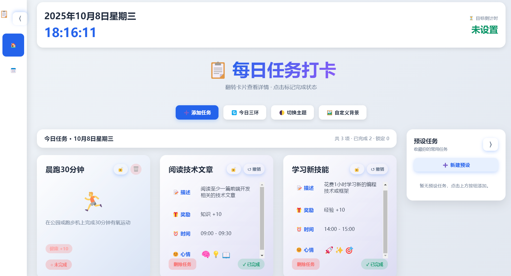

# Daily Tasks

一个以“打卡”驱动的桌面任务面板，用三色能量环帮助你保持节奏。针对健康、知识、经验三个维度记录每日任务，用更直观的视觉反馈提醒自己今天还差哪一环。

## 🌈 让三环保持满格
- **健康环**：记录运动、作息、饮水等身体管理任务，完成后立刻点亮绿色进度。
- **知识环**：学习、阅读、课程打卡都算数，蓝色环条随完成度增长。
- **经验环**：工作、技能、兴趣实践对应橙色环，结束一天时看到它绕满一圈最有成就感。

每个任务完成时都会播放翻转动画和纸屑庆祝，可随时撤销或重新打卡，进度与状态会即时同步到三环。

## 🗂️ 任务管理体验
- **自由添加任务**：输入标题、奖励、花费时间、心情等信息后即可加入当天列表。
- **翻转卡片**：点击任务卡即可查看详细备注、奖励积分、耗时等资料。
- **锁定模式**：将任务“锁定”后，它会被自动带入第二天，适合长期养成的习惯。
- **撤销与删除**：不小心打卡？只需再次点击即可撤销；确实不做的任务可直接删除。
- **任务统计**：页面顶部实时显示今日累计积分和耗时，帮助衡量当天节奏。

## ⏱️ 在时间线上自由穿梭
- 内置日历支持选择任意日期，查看某一天的打卡历史或提前排布未来任务。
- 应用会在跨越零点时自动刷新至下一天；已锁定的任务会自动继承，避免重复录入。
- 切换日期时三环、任务列表、统计信息都会同步刷新。

## 🧰 预设任务库
- 将常用的任务保存到右侧“预设”栏，下次只需点击一下即可快速加入当天。
- 预设支持自定义分类、奖励和备注，适合建立个人专属的习惯清单。

## 🎨 视觉与体验
- 不同属性的动效三环，实时呈现状态差距。
- 成功打卡后浮现纸屑、闪光等反馈，强化成就感。
- 提供深浅色主题及自定义背景选项，让面板适配你的桌面风格。

## 🏃 快速开始使用
1. （方式1）下载或克隆项目源码。
2. （方式2）安装release中的安装包

##  反馈与迭代
欢迎在 Issue 中提交建议或心得，也可以 Fork 后贡献新的功能（例如统计图表、跨设备同步等）。

希望这块“任务打卡器”能陪你完成更多小目标！

### 右上角Star🌟，等你点亮！
